<div align="center">
<picture>
  <source media="(prefers-color-scheme: dark)" srcset=".github/brand/banner-night.svg">
  
</picture>
<br><br>
<a href="#structure"><picture><source media="(prefers-color-scheme: dark)" srcset=".github/brand/tab-structure-night.svg"></picture></a>
<a href="#cloning"><picture><source media="(prefers-color-scheme: dark)" srcset=".github/brand/tab-cloning-night.svg"></picture></a>
<a href="#vision"><picture><source media="(prefers-color-scheme: dark)" srcset=".github/brand/tab-vision-night.svg"></picture></a>
<a href="#license"><picture><source media="(prefers-color-scheme: dark)" srcset=".github/brand/tab-license-night.svg"></picture></a>
</div>

<br>

ShadowedHunter is a dark, immersive metroidvania developed across two codebases — a legacy Java/Swing version and the current Unity C# implementation — with shared assets and design documents.

<p>
<a name="structure"></a>
<picture><source media="(prefers-color-scheme: dark)" srcset=".github/brand/section-structure-night.svg"></picture>
</p>

| Directory | Description |
|-----------|-------------|
| `java/` | Legacy Java Swing version — archived for reference |
| `unity/` | Current C# Unity implementation — primary development |
| `docs/` | Concept art, GDD, and planning materials |
| `assets/` | Shared sprites, sound effects, and resources |

<p>
<a name="cloning"></a>
<picture><source media="(prefers-color-scheme: dark)" srcset=".github/brand/section-cloning-night.svg"></picture>
</p>

```bash
# Clone with all submodules
git clone --recurse-submodules https://github.com/NoamFav/ShadowedHunter.git

# Or initialize submodules after cloning
git submodule update --init --recursive
```

<p>
<a name="vision"></a>
<picture><source media="(prefers-color-scheme: dark)" srcset=".github/brand/section-vision-night.svg"></picture>
</p>

Fast-paced combat combined with strategic puzzle elements, set in a dark immersive world. The Unity version is the primary direction for future development; the Java version remains archived for educational reference.

<p>
<a name="license"></a>
<picture><source media="(prefers-color-scheme: dark)" srcset=".github/brand/section-license-night.svg"></picture>
</p>

Proprietary — all rights reserved. © 2025 Noam Favier.

<div align="center">
Made with ❤️ by <a href="https://github.com/NoamFav">NoamFav</a>
</div>

<br>

<a href="https://nf-software.com">
<picture>
  <source media="(prefers-color-scheme: dark)" srcset=".github/brand/footer-night.svg">
  
</picture>
</a>
